# NagiosPlugins
Various Nagios plugins

## Table of Contents
- [CheckForRestartsAndUptime.ps1](#checkforrestartsanduptimeps1)
  - [Arguments](#arguments)
  - [Example](#example)
- [CheckNCPAVersion.ps1](#checkncpaversionps1)
  - [Arguments](#arguments-1)
  - [Example](#example-1)
- [CheckPSSignatures.ps1](#checkpssignaturesps1)
  - [Arguments](#arguments-2)
  - [Example](#example-2)
- [CheckTeamviewerVersion.ps1](#checkteamviewerversionps1)
  - [Arguments](#arguments-3)
  - [Example](#example-3)
- [CheckWazuhVersion.ps1](#checkwazuhversionps1)
  - [Arguments](#arguments-4)
  - [Example](#example-4)
- [CheckWinLocalAccounts.ps1](#checkwinlocalaccountsps1)
  - [Arguments](#arguments-5)
  - [Example](#example-5)

## [CheckForRestartsAndUptime.ps1](./CheckForRestartsAndUptime.ps1)

- Checks if server has been up for X amount of time
  - Measured in total hours i.e. 3 days = 72 hours
- Variables can specify critical threshold, warning threshold, and how far to look back in the event log
  - Also measured in total hours
- Will also return
  -  A CRITICAL value if any Error or Critical level event is found
  -  A WARNING value if any Warning level event is found
  -  Errors detected (Non info) in events will override uptime settings
      -  See example
- Nagios Exchange page: https://exchange.nagios.org/directory/Plugins/System-Metrics/Uptime/CheckForRestartsAndUptime/details

### Arguments

- WARNING: Threshold for the minimum amount of time the server has to be up
- CRITICAL: Threshold for more recently rebooted servers
- EventAge: How far back to look in the event log for reboot events

### Example

- `check_ncpa.py -t 'TOKEN' -P 5693 -M 'plugins/ShutdownAndUptime.ps1/24/12/24'`
  - Warning if the server has been up for less than 24 hours, Critical if it has been up for less than 12, look back 24 hours in the event log for reboot events
- `check_ncpa.py -t 'TOKEN' -P 5693 -M 'plugins/ShutdownAndUptime.ps1/6/4/24'`
  - Warning if the server has been up for less than 6 hours, Critical if it has been up for less than 4, look back 24 hours in the event log for reboot events
  - With the EventAge variable being larger than the uptime thresholds, it will report Critical, Error, & Warning level events with the appropriate exit codes even if uptime exceeds 6 or 4 hours 

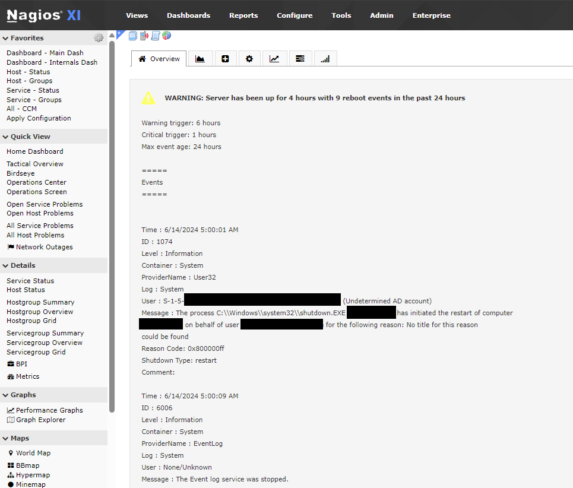
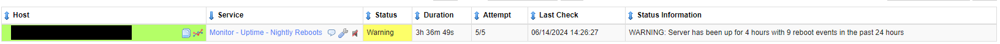
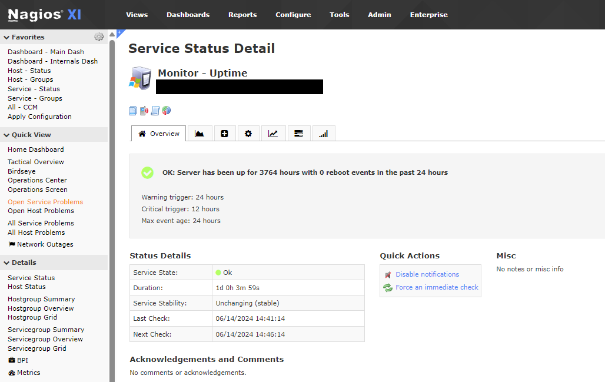
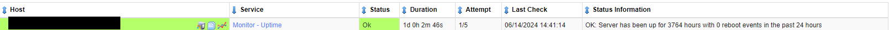

## [CheckNCPAVersion.ps1](./CheckNCPAVersion.ps1)

- Checks if current NCPA installed is up to date based on the latest GitHub release
- Nagios Exchange page: https://exchange.nagios.org/directory/Plugins/Software/CheckNCPAVersion/details

### Arguments

- N/A

### Example

- `check_ncpa.py -t 'TOKEN' -P 5693 -M 'plugins/CheckNCPAVersion.ps1'`

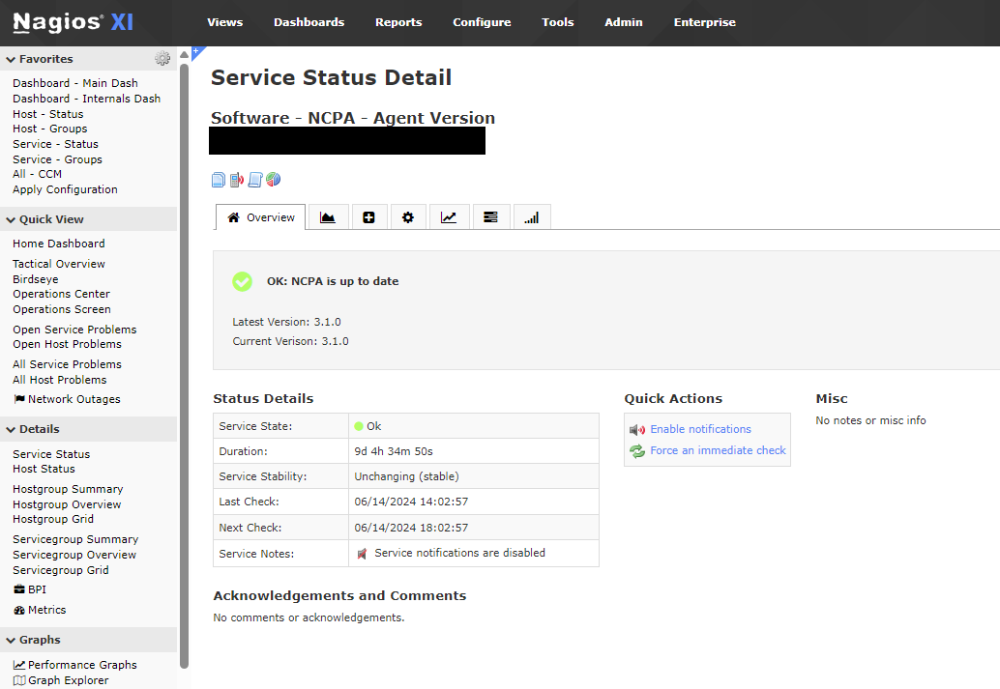
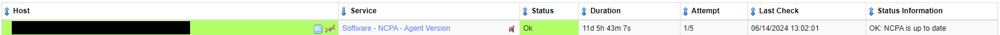

## [CheckPSSignatures.ps1](./CheckPSSignatures.ps1)

- Checks if any PS scripts in the plugin folder have a soon to expire, expired, invalid, or non-existent signature
- Arguments represent the number of days left until a signature expires. Any invalid or expired signatures will be considered critical
- Nagios Exchange page: https://exchange.nagios.org/directory/Plugins/Security/CheckPSSignatures/details

### Arguments

- WARNING: Threshold for the number of days left until a signature is considered soon to expire
- CRITICAL: Threshold for the number of days left until a signature is considered soon to expire

### Example

- `check_ncpa.py -t 'TOKEN' -P 5693 -M 'plugins/CheckScriptCertExperation.ps1/14/7'`
  - This will send a warning alert when a signature is about to expire in 14 or less days and then change to critical when it expires in 7 or less days

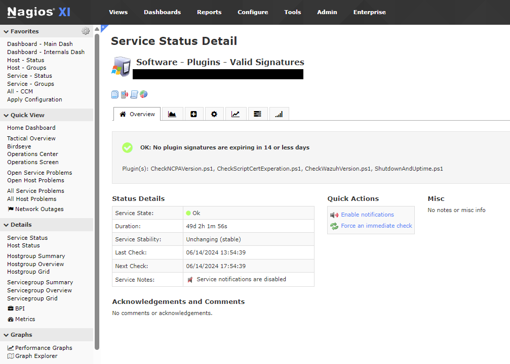
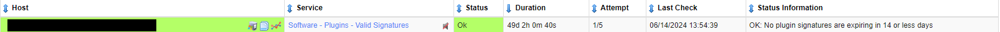

## [CheckTeamviewerVersion.ps1](./CheckTeamviewerVersion.ps1)

- Checks if computer is running an outdated TeamViewer
- Inside script there is a variable for $MaxMinorDif with a default value of '4'
  - This will determine the number of revisions between the latest version and the installed version
  - If it is more than 4 minor revisions behind, or 1+ major release behind, it reports CRITICAL
  - 4 or less revisions reports as WARNING
- **<ins>Currently not on Nagios Exchange</ins>**

### Arguments

- N/A

### Example

- `check_ncpa.py -t 'TOKEN' -P 5693 -M 'plugins/CheckTeamviewerVersion.ps1'`

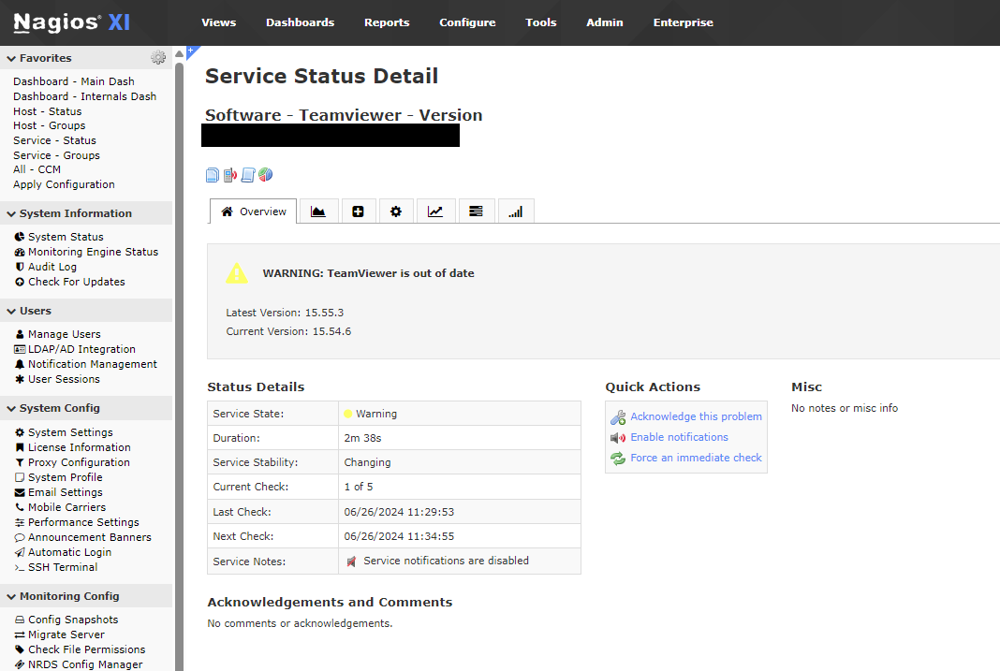
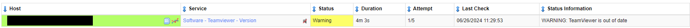

## [CheckWazuhVersion.ps1](./CheckWazuhVersion.ps1)

- Checks if computer is running an outdated Wazuh agent
- Inside script there is a variable for $MaxMinorDif with a default value of '4'
  - This will determine the number of revisions between the latest version and the installed version
  - If it is more than 4 minor revisions behind, or 1+ major release behind, it reports CRITICAL
  - 4 or less revisions reports as WARNING
- **<ins>Currently not on Nagios Exchange</ins>**

### Arguments

- N/A

### Example

- `check_ncpa.py -t 'TOKEN' -P 5693 -M 'plugins/CheckWazuhVersion.ps1'`

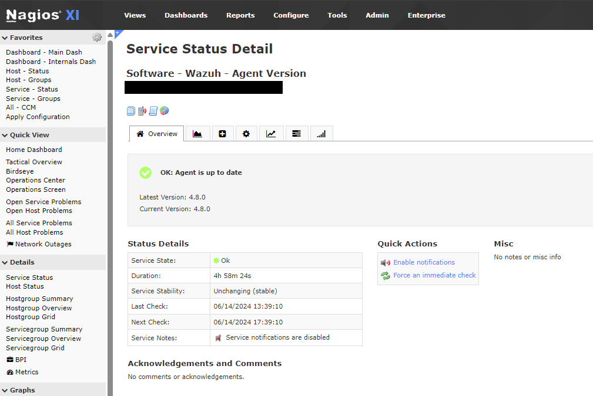
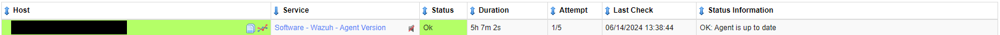

## [CheckWinLocalAccounts.ps1](./CheckWinLocalAccounts.ps1)

- Checks if specified users & groups are present, enabled, and an administrator on a local PC
- Variables can be configured to specify each group
- **<ins>Currently not on Nagios Exchange</ins>**

### Arguments

- N/A

### Example

- `check_ncpa.py -t 'TOKEN' -P 5693 -M 'plugins/CheckWinLocalAccounts.ps1'`

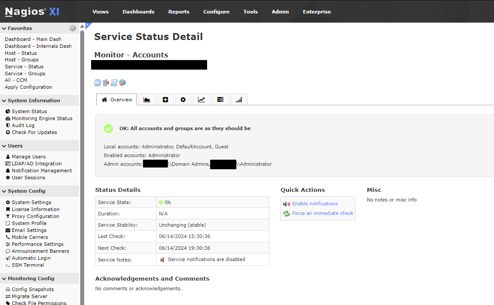
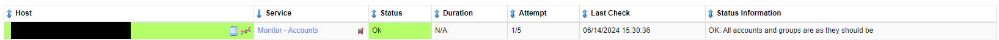
